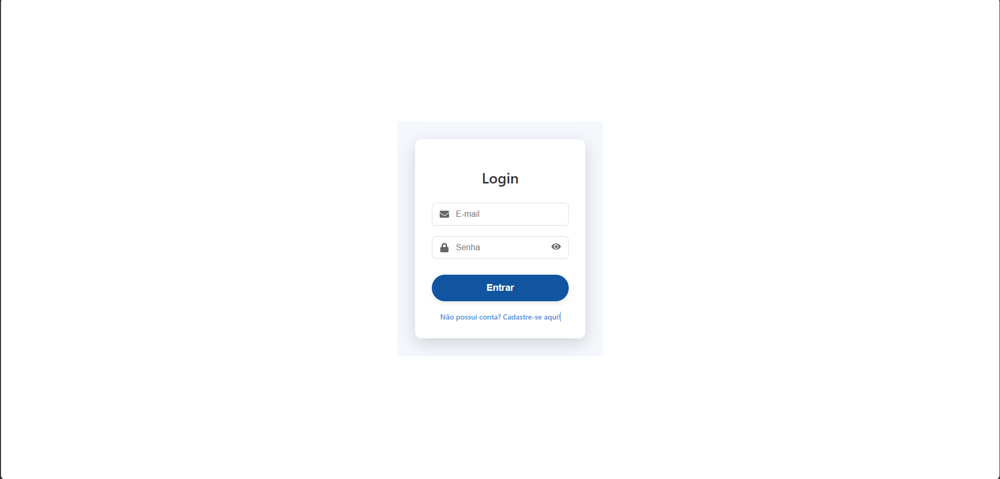
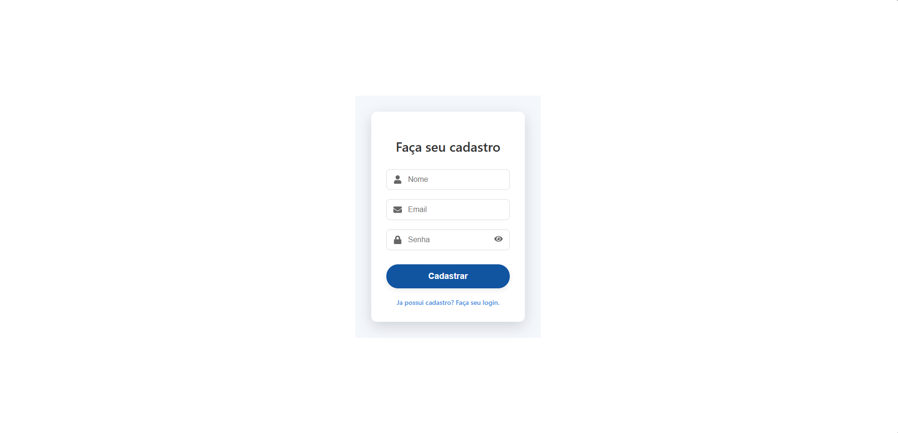
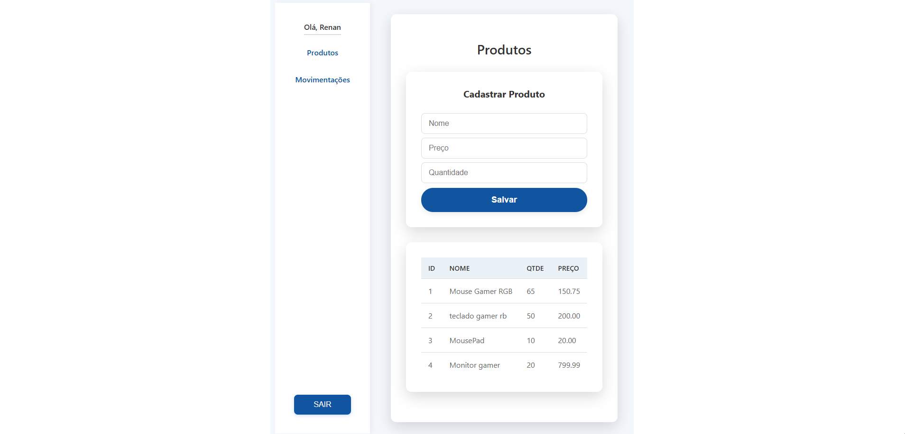
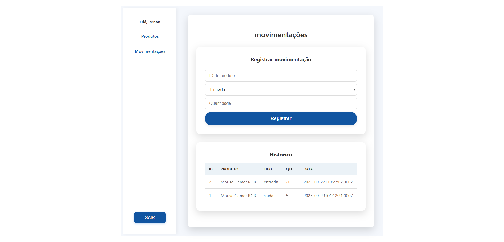

# Sistema de Gerenciamento de Estoque

Uma aplicação web para gerenciar produtos e suas movimentações

# ✨ Visão geral

Projeto que faz parte de um desafio técnico para uma vaga de estágio solicitado pela Keener.io

Este projeto oferece uma solução para controle de estoque, permitindo que o usuário cadastre produtos e faça movimentações de estoque(entrada e saida) de forma intuitiva

##🚀 Tecnologias Utilizadas

###FrontEnd(React)
* **React.js:** Biblioteca JavaScript para construção de interfaces de usuário.
* **React Router DOM:** Para navegação entre as páginas.
* **Axios:** Cliente HTTP para fazer requisições à API.
* **React Icons:** Para ícones.
* **Context API:** Para gerenciamento de estado global (autenticação).
* **CSS Puro:** Estilização com foco em consistência e praticidade.

### Backend (Node.js & Express)
* **Node.js:** Ambiente de execução JavaScript.
* **Express.js:** Framework web para construir a API RESTful.
* **MySQL:** Banco de dados relacional para armazenar os dados.
* **`mysql2`:** Driver MySQL para Node.js.
* **`bcryptjs`:** Para hash de senhas.
* **`jsonwebtoken`:** Para autenticação JWT.
* **`dotenv`:** Para gerenciamento de variáveis de ambiente.
* **`cors`:** Para lidar com políticas de Cross-Origin Resource Sharing.

##COMO RODAR O PROJETO

### Crie um arquivo ".env" na pasta backend e configure as variáveis do ambiente:

PORT=5000
DB_HOST=localhost
DB_USER=root
DB_PASSWORD=sua_senha_mysql
DB_DATABASE=seu_nome_bd
JWT_SECRET=sua_chave_secreta_jwt

###Navegue até a pasta backend
---cd backend
----npm install
-----npm start

####Depois navegue até a pasta frontend
---cd frontend
----npm install
-----npm start

### Funcionalidades
Autenticação de Usuário:
    Registro de novos usuários.
    Login de usuários existentes (com autenticação JWT).
    Manutenção da sessão de login ao recarregar a página.
Gerenciamento de Produtos:
    Cadastro de novos produtos (nome, preço, quantidade).
    Listagem de todos os produtos.
Gerenciamento de Movimentações:
    Registro de entradas e saídas de produtos no estoque.
    Histórico de todas as movimentações.
    Atualização automática da quantidade de produtos.

###SCREENSHOTS
 

 

 

 

 🚀 O que  pode Melhorar

Notificações ao Usuário: Usar um sistema de notificações (toasts) em vez de alert().

Funcionalidades CRUD Completas: Implementar edição e exclusão de produtos e movimentações.

Paginação e Filtros: Para grandes volumes de dados nas listas de produtos e movimentações.

Design Responsivo: Aprimorar a experiência em diferentes tamanhos de tela.

Testes: Adicionar testes unitários e de integração.

Barra de Pesquisa: Para facilitar a busca de produtos.

Dashboard: Uma tela inicial com um resumo do estoque.

###OBSERVAÇÕES

Projeto feita de forma prática, intuitiva e funcional, afim de testar e melhorar minhas habilidades conforme funcionalidades solicitadas pelo teste técnico, com margem para aprimoramento e aumento da aplicação.

